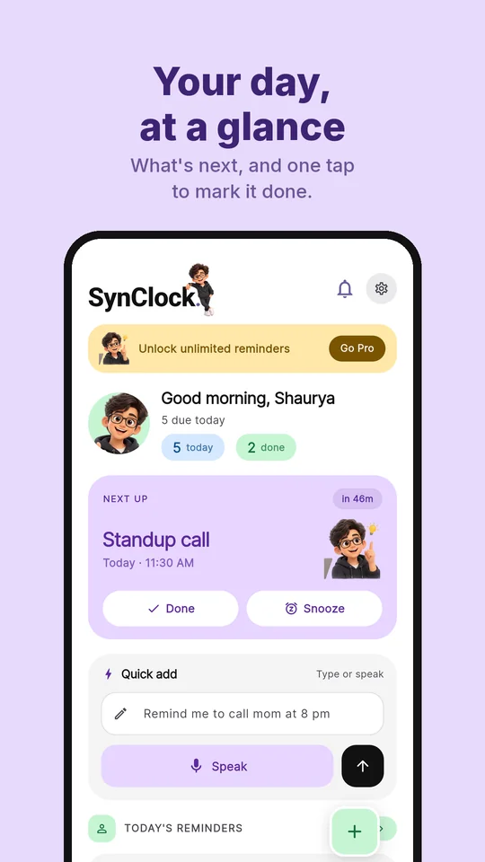
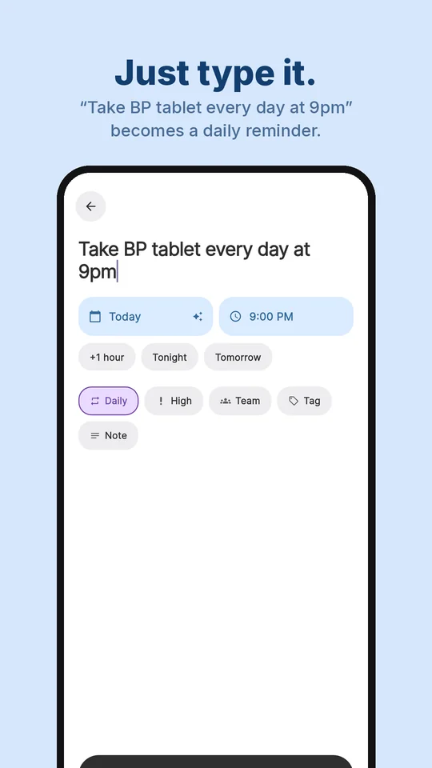
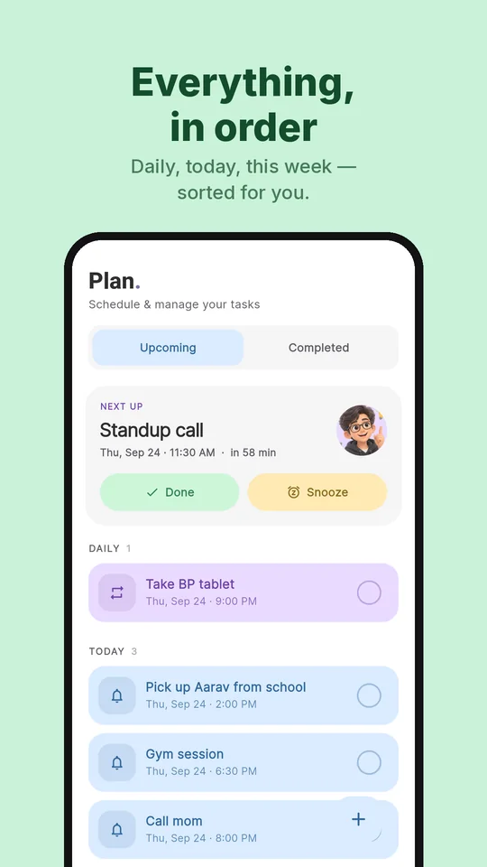
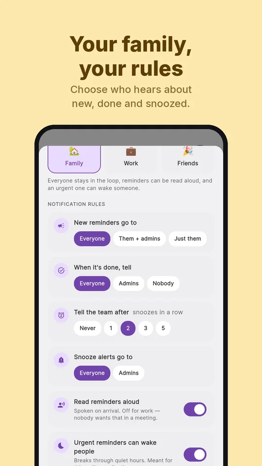
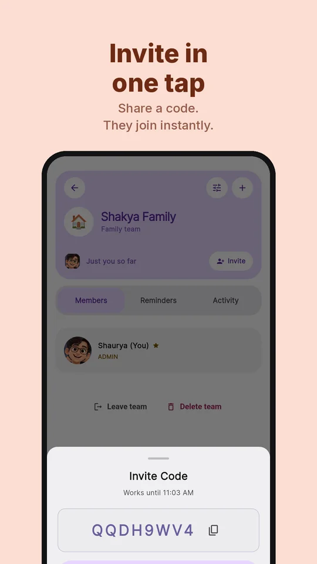
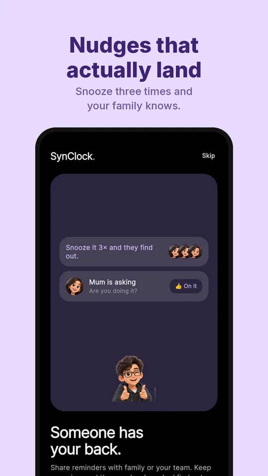
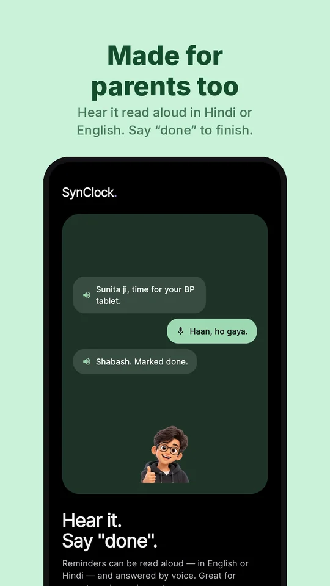
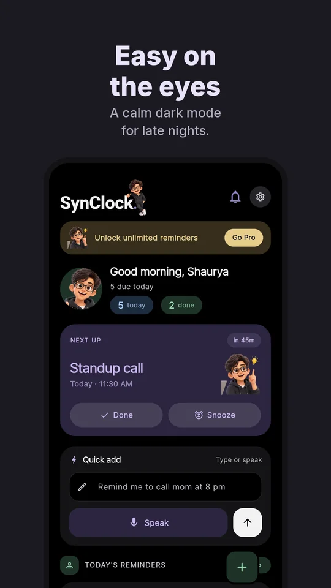

<h1 align="center">SynClock</h1>

<b>Type it. Share it. Know it got done.</b> 
Family reminders for Android: plain-English scheduling, exact alarms, shared teams with rules, and reminders read aloud in Hindi and English.

  <a href="https://github.com/shaurya-8055/synclock-app/releases/latest/download/SynClock.apk"><b>⬇ Download the latest APK</b></a> ·
  <a href="https://shaurya-8055.github.io/synclock/">Product site</a> ·
  <a href="https://github.com/shaurya-8055/synclock-app/releases">All releases</a>

  
  
  
  

  
  
  
  

---

## What it does

### Just type it
Write a reminder the way you'd say it — *“take BP tablet every day at 9pm”* — and SynClock fills in the day, the time and the repeat. Everyday phrasing is parsed **on the phone, in microseconds, with no network**. Only genuinely ambiguous sentences go to Gemini through SynClock's own server, with per-user daily limits and caching.

- The day and time fill in live as you type; a sparkle shows they came from your words.
- *every day*, *daily*, *weekly*, *every Monday*, *monthly* set the repeat and leave the title clean.
- One tap for **+1 hour**, **Tonight** or **Tomorrow**. Repeat, High priority, Team, Tag and Note are one chip away.

### Your day, at a glance
- **Next up** on Home with a live countdown, and **Done / Snooze** right on the card.
- **Plan** groups reminders into Daily, Today, This week and This month.
- **Done, 15m or Later straight from the notification**, even when the app is closed.
- A live **home-screen widget**.

### Someone has your back
Make a team for your family, your flat or your work crew and send a reminder straight to someone's phone — it rings for them, not you — and hear back when they tap Done.

| Rule | Choices |
|---|---|
| New reminders go to | Everyone · Them + admins · Just them |
| When it's done, tell | Everyone · Admins · Nobody |
| Tell the team after | Never · 1 · 2 · 3 · 5 snoozes in a row |
| Snooze alerts go to | Everyone · Admins |
| Read reminders aloud | On / Off |
| Urgent can wake people | Breaks through quiet hours — meant for medication |

Family, Work and Friends each start with sensible presets; owners can change any rule, and everyone can see them. Invite codes are eight characters, expire in 30 minutes, and only admins can make them. **Nudge** a member and they get *“Are you doing it?”* with a one-tap *“On it”*.

### Made for parents too
Reminders can be **read aloud in Hindi or English** and **answered by voice** — say *“haan, ho gaya”* and it's marked done. Easy-listening mode speaks slower and lower, says the name first and repeats once.

### Calm in light and dark
A flat pastel design with a muted dark mode — never neon.

## Under the hood

| | |
|---|---|
| **Client** | Flutter · Riverpod · GoRouter · Hive (offline-first) |
| **Alarms** | AlarmManager exact alarms — through Doze, restored after reboot |
| **Notifications** | flutter_local_notifications with actions in a background isolate · FCM for team pushes |
| **Parsing** | On-device grammar for everyday phrasing · Gemini fallback with quotas and a prompt cache |
| **Voice** | Text-to-speech and speech-to-text, Hindi and English |
| **Backend** | NestJS on Oracle Cloud · SQLite/libSQL · JWT auth · rate limiting · deployed by GitHub Actions |
| **Billing** | RevenueCat |
| **Quality** | Crashlytics in release builds · unit tests for parsing, dates, team rules and voice “done” |

## Installing

1. [Download the APK](https://github.com/shaurya-8055/synclock-app/releases/latest/download/SynClock.apk) — the link always serves the newest build.
2. Android will warn about installing outside the Play Store. Allow your browser or file manager to install unknown apps.
3. Open the file and install. Download again any time to update.

Requires **Android 8.0** or newer. One APK covers arm64-v8a, armeabi-v7a and x86_64.

## Privacy

No ads, and nothing is sold. Delete your account from **Settings** in the app, and your reminders, team memberships, AI usage and sign-in records are removed with it.

## Source

The application source is private. This repository distributes builds and screenshots. Questions about the implementation are welcome — [open an issue](https://github.com/shaurya-8055/synclock-app/issues).

---

Built by [Shaurya Shakya](https://shaurya-8055.github.io/) · [GitHub](https://github.com/shaurya-8055) · [LinkedIn](https://www.linkedin.com/in/shaurya-shakya8055)
